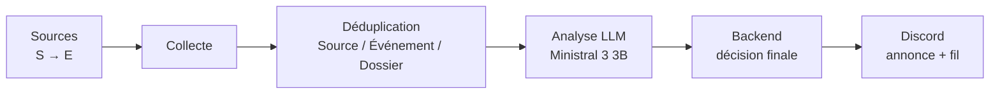

# Radar IA

Radar IA est un bot Discord de veille sur l’intelligence artificielle.

Il surveille des sources choisies, rapproche les articles qui parlent du même événement, écarte le bruit et les doublons, puis publie uniquement ce qui mérite d’être suivi. Une annonce n’est pas un flux RSS recraché dans un salon : c’est un dossier qui peut vivre et s’enrichir dans son fil Discord.

Il n’y a pas de site web ni d’API publique. Discord est le produit.

Documentation : [`docs/README.md`](docs/README.md) · Licence : [MIT](LICENSE)

---

## Le problème

Une annonce importante — un modèle, une publication de recherche, une release — est souvent reprise par plusieurs sources, avec des détails différents. Une veille RSS classique crée alors plusieurs messages pour un seul événement, et le signal se noie.

Radar IA cherche l’inverse : reconstruire l’événement, le publier une fois, puis faire suivre les informations nouvelles dans le fil de l’annonce.

```text
Annonce officielle
        ↓
Articles et sources complémentaires
        ↓
Même événement détecté
        ↓
Analyse assistée, décision côté backend
        ↓
Publication Discord (message + fil)
        ↓
Nouveaux éléments → le fil, pas un nouveau message
```

---

## Comment ça marche

1. **Collecte** — Radar IA lit des flux RSS / Atom de façon incrémentale (ETag, Last-Modified), avec retry, backoff, et protection contre les requêtes vers des cibles internes (SSRF).
2. **Rapprochement** — les articles sont rattachés à un dossier existant s’ils parlent vraiment du même événement ; sinon un nouveau dossier est créé. Les réseaux sociaux ne sont jamais des sources.
3. **Analyse** — un LLM local (Ollama, Ministral 3 3B) aide à résumer, classer et scorer. Il propose, il ne tranche pas.
4. **Décision** — le backend applique les règles métier (qualité de source, déduplication, seuils) et décide de publier, d’enrichir un fil, de retenir ou d’écarter.
5. **Discord** — le message principal présente l’annonce ; le fil raconte la suite. Les fils s’archivent au bout de 24 h et peuvent se rouvrir. En cas d’incident, la publication peut reprendre sans tout recréer.

Un worker dédié enchaîne ces étapes à intervalle régulier. L’administration se fait dans Discord, via `/radar-admin`, réservée à une liste d’utilisateurs.

---

## Le rôle du LLM

Le modèle aide à comprendre le contenu : résumé, classification, scoring, proposition JSON.

Les règles et la décision finale restent dans le backend. Sans ce contrôle, le LLM n’a aucun effet sur Discord. Une seule inférence tourne à la fois.

Détail : [`docs/Architecture/LLM.md`](docs/Architecture/LLM.md).

---

## Fonctionnalités

- Sources configurables hors code (`config/sources.json`), classées par niveaux de fiabilité (officiel → presse spécialisée).
- Aucun réseau social comme source.
- Collecte incrémentale, stockage brut puis articles normalisés.
- Déduplication autour de trois notions simples : la source, l’événement, le dossier.
- Analyse assistée par un LLM local, décision côté application.
- Publication Discord (annonce + fil), membres en lecture seule sur les salons concernés.
- Worker / scheduler, un cycle à la fois.
- Commandes `/radar-admin` (allowlist), reprise après incident.

---

## Architecture



Le worker orchestre le cycle. Le bot publie et expose l’admin. PostgreSQL et les sauvegardes restent hors du dépôt.

Vue d’ensemble : [`docs/Architecture/ARCHITECTURE.md`](docs/Architecture/ARCHITECTURE.md).

---

## Installation rapide

Guide complet : [`docs/Setup/INSTALL.md`](docs/Setup/INSTALL.md) · variables : [`docs/Setup/CONFIGURATION.md`](docs/Setup/CONFIGURATION.md).

Prérequis : Node.js 20 ou plus, Docker Compose, Ollama avec Ministral 3 3B, un bot Discord (token, salons, allowlist admin).

```bash
cp .env.example .env
cp config/sources.example.json config/sources.json
npm install
npm run prisma:generate
npm run prisma:migrate:deploy
npm run build
docker compose up -d                              # PostgreSQL + bot
docker compose --profile worker up -d worker      # cycles automatiques (optionnel)
npm run dev -w @radar-ia/api                      # /health, processus hôte (optionnel)
```

À adapter dans `.env` : secrets Discord, mot de passe PostgreSQL, `OLLAMA_MODEL`, et éventuellement `POSTGRES_DATA_PATH` (défaut `./data/postgres`).

Bot en développement, hors Compose : `npm run dev -w @radar-ia/bot`.

Sous Linux, le Compose validé utilise `network_mode: host` et Ollama sur `http://127.0.0.1:11434`. Ce mode n’est pas équivalent sous Docker Desktop Windows / macOS.

---

## Structure du dépôt

| Élément | Rôle |
|---------|------|
| `apps/api` | Fastify — `/health` |
| `apps/bot` | Bot Discord — publication et `/radar-admin` |
| `apps/worker` | Scheduler et pipeline |
| `packages/analysis` | Client Ollama et analyse |
| `packages/collector` | HTTP sécurisé, RSS/Atom, registre des sources |
| `packages/config` | Configuration (Zod) |
| `packages/database` | Prisma et orchestrateurs |
| `packages/shared` | Matching et contenu Discord |
| `config/` | Registre des sources (hors code) |
| [`docs/`](docs/README.md) | Documentation |

`npm run build` compile les workspaces dans l’ordre des dépendances. Détail : [`docs/Setup/INSTALL.md`](docs/Setup/INSTALL.md).

---

## Documentation

| Document | Contenu |
|----------|---------|
| [`docs/README.md`](docs/README.md) | Index de la documentation |
| [`docs/Setup/INSTALL.md`](docs/Setup/INSTALL.md) | Installation |
| [`docs/Setup/CONFIGURATION.md`](docs/Setup/CONFIGURATION.md) | Configuration |
| [`docs/Architecture/ARCHITECTURE.md`](docs/Architecture/ARCHITECTURE.md) | Architecture |
| [`docs/Architecture/DISCORD.md`](docs/Architecture/DISCORD.md) | Publication Discord |
| [`docs/Architecture/LLM.md`](docs/Architecture/LLM.md) | Rôle du LLM |
| [`docs/Reference/SOURCES.md`](docs/Reference/SOURCES.md) | Sources et collecte |
| [`docs/Reference/SECURITY.md`](docs/Reference/SECURITY.md) | Sécurité technique |
| [`SECURITY.md`](SECURITY.md) | Signaler une vulnérabilité |
| [`docs/Project/CONTRIBUTING.md`](docs/Project/CONTRIBUTING.md) | Contribuer |
| [`docs/Project/ROADMAP.md`](docs/Project/ROADMAP.md) | Feuille de route |
| [`docs/Project/CHANGELOG.md`](docs/Project/CHANGELOG.md) | Historique des versions |
| [`docs/handoff.md`](docs/handoff.md) | Décisions et état du projet |

---

## Contribuer

Voir [`docs/Project/CONTRIBUTING.md`](docs/Project/CONTRIBUTING.md).

En pratique : respecter les décisions déjà prises, ne pas inventer de règle métier, ne pas brancher de réseaux sociaux comme sources. En cas de doute, [`docs/handoff.md`](docs/handoff.md) fait foi.

---

## Licence

[MIT](LICENSE).
