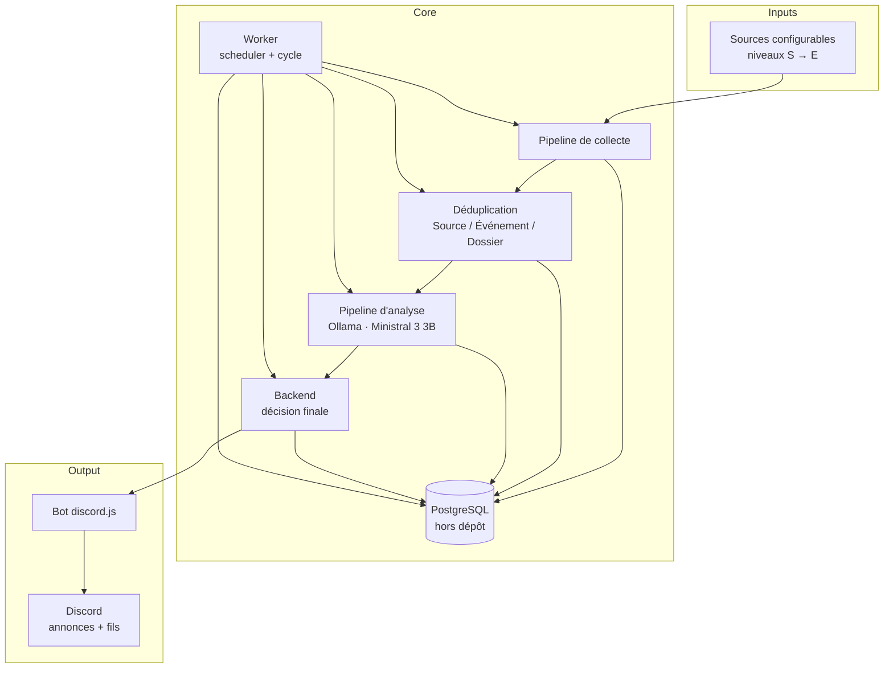
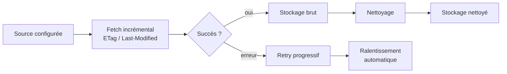
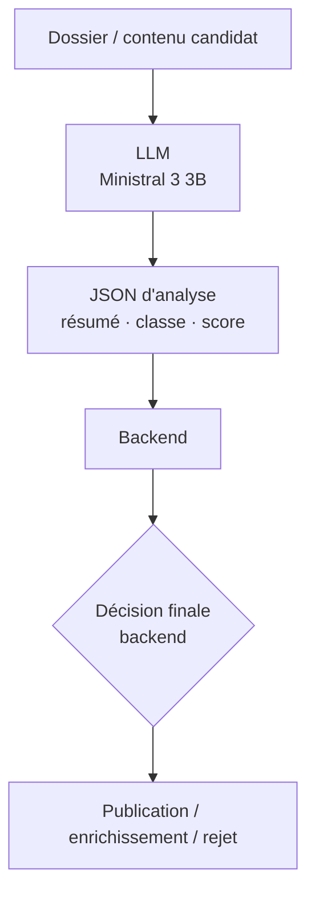
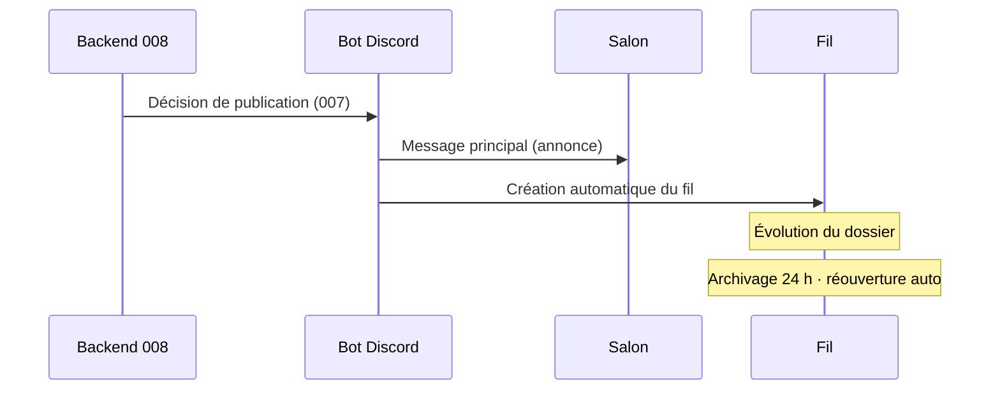

# Architecture — Radar IA

Version de référence : **1.0**  
Source officielle : [`handoff.md`](../handoff.md)

Ce document formalise l'architecture **gelée** et livrée (modules 001–010).

Documents liés : [`SOURCES.md`](../Reference/SOURCES.md), [`LLM.md`](LLM.md), [`DISCORD.md`](DISCORD.md), [`SECURITY.md`](../Reference/SECURITY.md).

**Administration** : worker dédié, ops Discord allowlistées + CLI, single-flight PostgreSQL ; pas de plateforme Web. Détail : [`DISCORD.md`](DISCORD.md).

Orchestration de cycle (**009.1C**) : `createPipelineOrchestrator` dans `@radar-ia/database` compose collecte → normalisation → matching → analyse → publication (+ resume) derrière le verrou 009.1B. Ports injectables (registre, collecteur, Discord).

Worker dédié (**009.1D**) : hôte `@radar-ia/worker` — scheduler, composition réelle du pipeline, client Discord publication-only, arrêt propre `SIGINT`/`SIGTERM`.

Surface admin (**009.1E**) : slash `/radar-admin` sur `@radar-ia/bot` (allowlist `DISCORD_ADMIN_USER_IDS`).

---

## Vue d'ensemble

Radar IA est un système de veille IA dont **Discord** est l'unique interface produit.

Principes structurants :

- le **dossier d'actualité** est l'unité métier ;
- le **backend** applique les règles et tranche ;
- le **LLM** assiste uniquement l'analyse éditoriale ;
- **pas** de plateforme Web, **pas** d'API publique, **pas** de multi-agent.

---

## Composants

| Composant | Rôle retenu |
|-----------|-------------|
| Sources | Entrées configurables hors code ; niveaux S à E ; hors réseaux sociaux |
| Collecte | Récupération incrémentale, stockages brut et nettoyé, SSRF |
| Déduplication | Relie Source, Événement et Dossier |
| Analyse (LLM) | Résume, classe, score, produit un JSON |
| Backend / orchestrateurs | Autorité de décision (`@radar-ia/database`) |
| API Fastify | Surface interne `/health` uniquement (`@radar-ia/api`) |
| PostgreSQL | Persistance (hors dépôt) |
| Prisma | Accès données (`@radar-ia/database`) |
| Bot Discord | Publication, fils, slash admin (`@radar-ia/bot`) |
| Worker | Scheduler + cycle d’exploitation (`@radar-ia/worker`) |
| Ollama | Runtime LLM partagé |
| Ministral 3 3B | Modèle unique (Modelfile dédié) |
| Docker Compose | Postgres + bot permanents (Linux `network_mode: host`) ; worker optionnel (profile) |

---

## Backend

- Stack : **TypeScript**, **Node.js LTS** (≥ 20), **Fastify**.
- Organisation : **npm Workspaces** (`apps/*`, `packages/*`).
- Responsabilité centrale : appliquer les règles métier et garder la **décision finale** après analyse LLM.
- Pas d'API publique exposée (`@radar-ia/api` = `/health` interne).

Packages stables : voir [`handoff.md`](../handoff.md) §12 et [`../README.md`](../../README.md).

---

## Discord

Discord est l'interface du produit.

- Catégorie dédiée.
- Salons : `#flux-rss-brut`, `#flux-ia`, `#veille-pertinente`, `#annonces-majeures`, plus **3 salons RSS techniques**.
- Chaque annonce crée automatiquement un **fil**.
- Message principal = annonce ; fil = évolution.
- Archivage : **24 h** ; réouverture automatique.
- Membres en **lecture seule**.
- Reprise automatique après incident.
- Admin : `/radar-admin` (allowlist utilisateur).

Détail : [`DISCORD.md`](DISCORD.md).

---

## PostgreSQL

- Base de données officielle du projet.
- **Hors dépôt** (Compose local bind `127.0.0.1` ou instance externe).
- Sauvegardes **hors dépôt**.

Schéma : `packages/database/prisma/schema.prisma` + migrations versionnées.

---

## Prisma

- ORM retenu pour l'accès PostgreSQL.
- Package `@radar-ia/database` : modèles collecte, articles, matching, analyse, publication, administration.
- Commandes : `npm run prisma:generate` · `npm run prisma:migrate:deploy`.

---

## Ollama

- Instance **partagée**.
- Sert exclusivement le modèle retenu.
- Contrainte : **une seule inférence simultanée** (lease PostgreSQL — 010.1A).

---

## LLM

- Modèle unique : **Ministral 3 3B** (Modelfile dédié).
- Rôles : résumé, classification, scoring, production JSON (`AnalysisProposalV1`).
- Limite structurante : le LLM **ne décide jamais seul**.

Détail : [`LLM.md`](LLM.md).

---

## Pipeline de collecte

Règles gelées :

- collecte incrémentale ;
- ETag / Last-Modified ;
- retry progressif ;
- ralentissement automatique des sources en erreur ;
- stockage brut + nettoyé ;
- protection SSRF (pin DNS — 010.1A).

Voir [`SOURCES.md`](../Reference/SOURCES.md) et [`SECURITY.md`](../Reference/SECURITY.md).

---

## Pipeline d'analyse

- Le LLM assiste l'analyse éditoriale.
- Le backend tranche toujours.
- Une seule inférence à la fois.

---

## Pipeline de publication

Orchestration `@radar-ia/database` + adaptateur `@radar-ia/bot`. Détail produit : [`DISCORD.md`](DISCORD.md).

Philosophie éditoriale :

- annoncer clairement ;
- suivre dans le fil ;
- limiter le bruit grâce au scoring et à la déduplication en amont ;
- backend décide ; bot exécute ; Discord n’est pas la source de vérité.

---

## Limites d'architecture

| Exclu | Statut |
|-------|--------|
| Plateforme Web | Hors périmètre |
| API publique | Hors périmètre |
| Multi-agent | Hors périmètre |
| Réseaux sociaux comme sources | Interdit |
| Plusieurs modèles LLM | Non retenu |

Idées reportées : [`ROADMAP.md`](../Project/ROADMAP.md) — section Idées futures.
