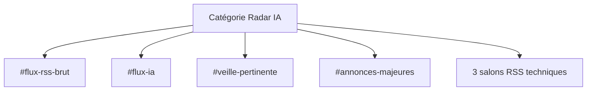
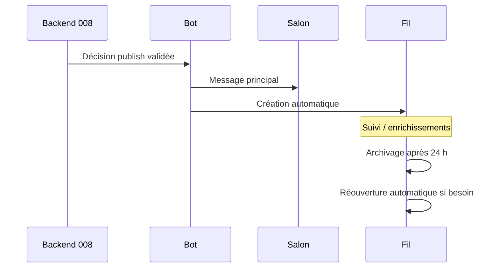

# Discord — Radar IA

Version de référence : **1.0** (doctrine produit + module 008 livré)  
Source officielle : [`handoff.md`](../handoff.md)

Discord est **l'interface du produit**. Il n'y a pas de plateforme Web associée.

Documents liés : [`ARCHITECTURE.md`](ARCHITECTURE.md), [`LLM.md`](LLM.md), [`CONFIGURATION.md`](../Setup/CONFIGURATION.md).

---

## Philosophie éditoriale

| Principe | Application |
|----------|-------------|
| Le message principal présente l'annonce | Point d'entrée clair et stable |
| Le fil raconte son évolution | Suivi chronologique du dossier |
| Publier uniquement le pertinent | Moins de bruit, plus de signal |
| Lecture seule pour les membres | Canal maîtrisé, pas de débat dans les flux |
| Reprise après incident | Continuité de service sans intervention manuelle systématique |
| Backend décide, bot exécute | Discord n’est jamais la source de vérité métier |

Le dossier d'actualité reste l'unité métier ; Discord en est la vitrine opérationnelle.

---

## Structure des salons

Catégorie dédiée contenant :

| Salon | Rôle connu | Publication métier 008 V1 |
|-------|------------|---------------------------|
| `#flux-rss-brut` | Flux brut / technique | Hors chemin `publish` |
| `#flux-ia` | Flux IA | Oui (`channelHint = flux_ia`) |
| `#veille-pertinente` | Veille filtrée / pertinente | Oui (défaut ≥ seuil 007) |
| `#annonces-majeures` | Annonces majeures | Oui (seuils stricts 007) |
| **3 salons RSS techniques** | Salons techniques RSS (noms exacts **non formalisés**) | Hors chemin `publish` V1 |

---

## Fonctionnement des publications

État : gel **008.1A** ; persistance **008.1B** ; construction contenu **008.1C** (`buildMainPublicationContent` / `buildEnrichmentPublicationContent` dans `@radar-ia/shared`) ; orchestrateur **008.1D** (`createPublicationOrchestrator` + port `DiscordPublicationPort` dans `@radar-ia/database`) ; implémentation discord.js **008.1E** dans `@radar-ia/bot` (`createDiscordPublicationAdapter`, `createPublicationChannelResolver`) ; **validation / intégration 008.1F** (tests pipeline mocks + frontières packages) — module 008 **terminé**.

1. Le backend (007) décide (`publish` / `enrich_thread_only` / `hold` / `reject_editorial`).
2. L’orchestrateur 008 (`createPublicationOrchestrator`) exécute via le port Discord injectable.
3. Le contenu Discord est construit de façon pure / déterministe (008.1C) avant tout appel réseau.
4. Le bot résout le salon métier via configuration (`DISCORD_CHANNEL_*`) sans fallback.
5. Le port discord.js crée le **message principal** (annonce) dans le salon résolu avec `allowedMentions` verrouillé.
6. Un **fil** est créé automatiquement depuis ce message (`autoArchiveDuration = 1440`).
7. Les enrichissements `enrich_thread_only` alimentent le fil uniquement ; un fil archivé est rouvert si nécessaire.
8. `hold` / `reject_editorial` : aucune action Discord.

Persistance officielle (008.1B) : état courant `FolderPublication` (unicité par dossier) + historique append-only `PublicationAttempt` ; réservation DB avant tout appel Discord ; snowflakes en chaînes.

Contenu (008.1C) : texte court + embed abstrait (sans `discord.js`) ; salons métier `ANNONCES_MAJEURES` / `VEILLE_PERTINENTE` / `FLUX_IA` ; sanitization mentions / HTML ; troncature plafonds Discord ; nom de fil `Veille — {title}`.

Orchestration (008.1D) : `process()` / `resume()` ; ordre réserve → build → port → persist ; succès partiel (`partial`) repris via `create_thread` ; idempotence par clés gelées.

Adapter bot (008.1E) :

- `createDiscordPublicationAdapter(client)` implémente `DiscordPublicationPort` avec `discord.js` ;
- vérifications minimales : salon/fil accessible, type textuel compatible, permissions `SendMessages`, `EmbedLinks`, `CreatePublicThreads`, `SendMessagesInThreads`, `ManageThreads` si désarchivage ;
- normalisation d’erreurs vers `DiscordPublicationPortError` (`channel_unavailable`, `missing_permission`, `discord_timeout`, `discord_unavailable`, `inconsistent_state`, `unknown`) ;
- aucun réseau Discord réel dans les tests (doubles injectés).

Validation / intégration (008.1F) :

- tests pipeline `@radar-ia/database` : décision 007 → orchestrateur → port mock → repository (Prisma double) ;
- tests bot : adaptateur discord.js + orchestrateur sans réseau ;
- scénarios couverts : publish, enrich, hold, reject, partial/resume, idempotence, closed, erreurs retryable/terminales, salon absent, thread archivé/verrouillé, IDs perdus, redémarrage, anti-duplication ;
- frontières vérifiées : `discord.js` uniquement dans `apps/bot` ; Prisma uniquement dans `@radar-ia/database` ; aucune logique métier dans le bot.

Le LLM prépare le contenu analytique en 007 ; il ne décide pas de la publication. Voir [`LLM.md`](LLM.md).

---

## Fils

- Création **automatique** à chaque annonce (attachée au message principal).
- Rôle : raconter l'**évolution** de l'annonce / du dossier.
- Archivage : **24 h** (`publication.threadArchiveDurationHours = 24`).
- **Réouverture automatique** avant enrichissement si le fil est archivé.

---

## Archivage

| Paramètre | Valeur retenue |
|-----------|----------------|
| Délai d'archivage | 24 heures |
| Réouverture | Automatique |
| Objectif | Conserver des salons lisibles tout en préservant le suivi |

---

## Permissions

- Les membres sont en **lecture seule** sur les salons concernés.
- Le bot assure la publication et la gestion des fils (moindre privilège ; **pas** d’Administrator).
- Détail V1 : gel 008.1A §13.

### Administration Discord (009.1E)

Surface ops **slash** restreinte — allowlist d’**IDs utilisateur** uniquement (`DISCORD_ADMIN_USER_IDS`, pas de rôles).

| Commande | Rôle |
|----------|------|
| `/radar-admin status` | Synthèse pipeline (lock, dernier run, files publication / analyse / matching) |
| `/radar-admin sources` | Registre fichier + état runtime (backoff, HTTP, échecs) |
| `/radar-admin cycle` | Lancement manuel d’un cycle (`trigger=manual`, single-flight PG) |
| `/radar-admin resume` | Reprise publications retryables (`folder_id` optionnel) |
| `/radar-admin reanalyse` | Force réanalyse (`folder_id` + `confirm=true` obligatoire) |
| `/radar-admin interventions` | Consultation des dossiers / files à traiter manuellement |

Règles :

- réponses **éphémères** ;
- aucune logique métier dans le bot — appels à `createAdminOpsService` / orchestrateurs 006–008 / pipeline ;
- audit append-only (`AdminOperationLog`) pour chaque ops mutative ;
- secrets absents des réponses ;
- enregistrement des commandes en **guild commands** au `ClientReady`.

Commandes, allowlist et reprise : voir aussi [`CONFIGURATION.md`](../Setup/CONFIGURATION.md).

---

## Reprise après incident

- **Reprise automatique** après incident (file persistée, idempotence, réconciliation ciblée).
- Objectif : état cohérent sans intervention manuelle systématique.
- Pas de scan global de la guilde ; cas incohérents (suppression manuelle) → alerte / ops manuelles module **009**.

La reprise s’appuie sur la file persistée, l’idempotence et une réconciliation ciblée — pas un scan global de la guilde.

---

## Configuration

La configuration Discord (token, IDs de guilde / salons, etc.) est traitée dans [`CONFIGURATION.md`](../Setup/CONFIGURATION.md).
Existants : `DISCORD_TOKEN`, `DISCORD_CLIENT_ID`, `DISCORD_GUILD_ID`, archivage 24 h.
Variables métier V1 : `DISCORD_CHANNEL_ANNONCES_MAJEURES`, `DISCORD_CHANNEL_VEILLE_PERTINENTE`, `DISCORD_CHANNEL_FLUX_IA` (snowflakes Discord, validés par `@radar-ia/config`).
Aucune valeur secrète ne doit être commitée.
