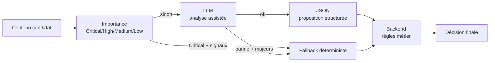

# LLM — Radar IA

Version de référence : **1.0**  
Source officielle : [`handoff.md`](../handoff.md)

Ce document formalise le rôle du modèle de langage dans Radar IA.

Documents liés : [`ARCHITECTURE.md`](ARCHITECTURE.md), [`CONFIGURATION.md`](../Setup/CONFIGURATION.md), [`SECURITY.md`](../Reference/SECURITY.md).

---

## Rôle du LLM

Le LLM **assiste uniquement l'analyse éditoriale**.

Il :

- **résume** ;
- **classe** ;
- **score** ;
- **produit un JSON**.

Il ne remplace ni le backend, ni la doctrine des sources, ni les règles Discord.

---

## Règle structurante

> **Le LLM ne décide jamais seul.**
> **La décision finale est toujours réalisée par le backend.**

Cette séparation est gelée. Toute évolution qui confierait la décision métier au seul LLM serait hors cadre.

### Mode dégradé + importance déterministe (2026-08-01 Correctif 2)

Avant toute inférence LLM, `evaluateImportance` classe l’annonce en **Critical / High / Medium / Low** (éditeur officiel, tier, nouveau modèle / famille, annonce, GA, lancement).

- **Critical** (whitelist officielle + signaux majeurs) : publication via `deterministic_fallback` **avant** l’appel Ollama — une panne LLM ne peut plus faire manquer l’annonce.
- **Autres** : chemin LLM normal ; si Ollama échoue (transport, timeout, modèle absent, JSON/schéma invalide), fallback déterministe pour annonces majeures whitelist / Tier S.

Whitelist éditeurs : OpenAI, Anthropic, Google, DeepMind, Meta, Mistral, Cursor, Qwen, DeepSeek, AI2, Ollama, Hugging Face.

Garanties :

- idempotence Discord inchangée (`publish:${folderId}`) ;
- enrichissement ultérieur possible quand le LLM revient ;
- **pas** un miroir RSS.

---

## Limites

| Limite | Décision |
|--------|----------|
| Modèle | Unique : **Ministral 3 3B** |
| Runtime | **Ollama partagé** |
| Packaging | **Modelfile dédié** |
| Parallelisme | **Une seule inférence simultanée** |
| Multi-agent | **Non** |
| Décision métier | **Interdite au LLM seul** |
| Interface produit | Discord ; le LLM n'est pas exposé aux utilisateurs finaux |

---

## Format JSON attendu

Le LLM **produit un JSON** portant a minima : résumé, classification / catégorisation, scoring.

Contrats applicatifs : `AnalysisProposalV1` / `ValidatedAnalysisV1` (seuils, retries, ancrage) dans `@radar-ia/analysis`.

**Persistance livrée (007.1B)** : modèle Prisma `AnalysisAttempt` + repository `createAnalysisAttemptRepository` dans `@radar-ia/database` (historique append-only des tentatives / résultats validés / traces d’échec).

**Client Ollama livré (007.1C)** : package `@radar-ia/analysis` — `createOllamaAnalysisClient` (concurrency = 1, timeouts / retries gel 007.1A) + validation stricte `AnalysisProposalV1` (`parseAnalysisProposalJson` / `validateAnalysisProposal`).

**Service d’analyse livré (007.1D)** : `createAnalysisService` dans `@radar-ia/analysis` — éligibilité, fingerprint SHA-256, contexte borné, prompt, ancrage des faits, scoring backend, décisions `publish` / `enrich_thread_only` / `hold` / `reject_editorial`, persistance via port compatible `createAnalysisAttemptRepository` (007.1B).

**Orchestration livrée (007.1E)** : `createAnalysisOrchestrator` dans `@radar-ia/database` — mapping issues 006 → chargement agrégat dossier → appel 007.1D → résultats typés `analyzed` / `reused` / `skipped` / `failed`. Pas de transaction autour d’Ollama ; erreur 007 ne rollback pas 006. Aucune publication Discord / Fastify / 008.

**Module 007 terminé (007.1F)** : validation finale — contrats gel 007.1A, exports publics, dépendances workspace, matrice d’acceptation §17 A–O, idempotence terminale (`hold` non réutilisé pour permettre l’anti-blocage). Gel Publication Discord (**008.1A**) livré. Prochaine étape officielle : **008.1B**.

Principe déjà gelé :

- le JSON est une **proposition structurée** ;
- le backend **valide et tranche** ;
- aucune publication ne doit reposer sur le seul avis du modèle.

---

## Scoring

- Le LLM contribue au **score**.
- Le backend conserve l'autorité pour accepter, rejeter, enrichir un dossier ou publier.
- Barèmes, seuils et poids S–E : backend (`@radar-ia/analysis`), pas une décision autonome du modèle.

---

## Résumé

- Le LLM produit un **résumé** destiné à l'usage éditorial interne et à la préparation de publication.
- Le message Discord principal présente l'annonce ; le fil suit l'évolution — le LLM alimente l'analyse, pas la gouvernance du fil.

---

## Catégorisation

- Le LLM **classe** le contenu.
- La classification s'inscrit dans le pipeline d'analyse avant décision backend.
- Le mapping précis vers les salons Discord (`#veille-pertinente`, `#annonces-majeures`, etc.) est une responsabilité du **backend**, pas une décision autonome du modèle.

Voir [`DISCORD.md`](DISCORD.md).

---

## Décision finale (backend)

Le backend :

1. reçoit le JSON d'analyse ;
2. applique les règles métier (sources, déduplication, publication) ;
3. décide de la suite (publication, enrichissement de dossier, non-publication, etc.).

Sans backend, le LLM n'a pas d'effet produit.

---

## Exploitation

| Élément | État retenu |
|---------|-------------|
| Ollama | Partagé |
| Inférences concurrentes | Une seule |
| Modèle de secours | Non retenu |
| API publique du LLM | Hors périmètre |

Configuration : [`CONFIGURATION.md`](../Setup/CONFIGURATION.md).
