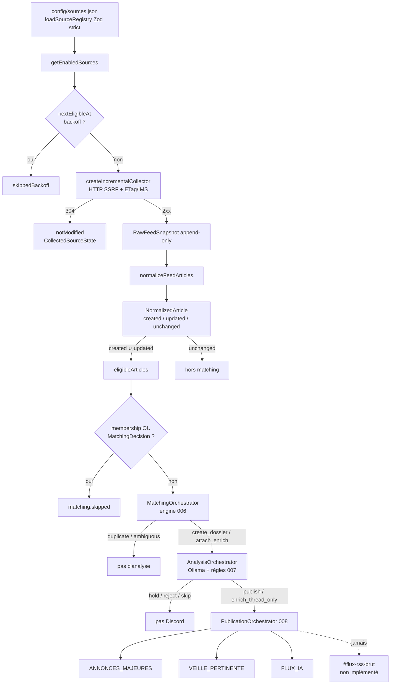

# Audit — Sources et diffusion Discord

| | |
|---|---|
| **Date** | 2026-07-17 |
| **Périmètre** | Registre → collecte → normalisation → matching → analyse → publication |
| **Machine agent** | Windows (dépôt local) — Docker / PostgreSQL Ubuntu **non** accessibles |
| **Runtime de référence** | Ubuntu validé (handoff 2026-07-17 15:35) |
| **Modifications métier** | Aucune (rapport documentaire uniquement) |

Sources d’autorité utilisées : `docs/handoff.md`, gels 006.1A–009.1A, `docs/Reference/SOURCES.md`, `docs/Architecture/DISCORD.md`, code `@radar-ia/collector|database|analysis|bot|worker|config|shared`, tests Vitest ciblés, `config/sources.json` local.

`Project_Instructions.md` et `.gpt/` : **absents** du dépôt au moment de l’audit.

---

## 1. Résumé exécutif

### Pourquoi Discord est vide

**Cause immédiate (cycles récents)** : le pipeline n’envoie à Discord que après `matching` → `analyse` → décision `publish` / `enrich_thread_only`. Les logs observés (`created: 0`, `updated` avec `matching.skipped`, `analysis: 0`, `publication: 0`) prouvent qu’**aucun objet n’atteint l’étape publication** dans l’état stationnaire actuel.

Preuve code : seuls les articles `created` / `updated` du cycle courant entrent dans la file matching ; s’ils ont déjà une appartenance dossier ou une `MatchingDecision`, ils sont comptés `matching.skipped` et **n’appellent ni analyse ni publication** (`packages/database/src/pipeline-orchestrator.ts`, boucle `eligibleArticles`).

**Cause structurelle** : `FLUX_IA` (et les deux autres salons métier) ne sont **pas** un miroir des articles RSS. Ce sont des destinations du chemin éditorial 007→008 après score / décision backend.

**Cause historique (non mesurable ici sans SQL Ubuntu)** : les ~1 200 articles déjà en base ne republient pas seuls. S’ils ont été matchés / analysés sans `publish`, ou collectés puis laissés `unchanged` sans décision, le cycle incrémental **ne les reprend pas**. Diagnostic SQL fourni en §7 / §11.

### Rôle réel de `FLUX_IA`

**Destination métier du pipeline éditorial**, pas un flux RSS brut.

- Hint backend `flux_ia` via `mapChannelSalonHint` (composite ≥ 70 **et** `suggestedChannelRole === flux_ia`) — `packages/analysis/src/analysis-decision.ts`.
- Résolution Discord : `DISCORD_CHANNEL_FLUX_IA` — `createPublicationChannelResolver` (`apps/bot/src/publication/discord-channel-resolver.ts`).
- Gel 008.1A §7.1 / doctrine 008.0 : `#flux-ia` = chemin `publish` ; `#flux-rss-brut` = **hors** orchestrateur.

### Statut réel des sources GitHub

**Pas de collecteur GitHub API.** Cinq sources du registre pointent vers des flux **Atom de releases** `github.com/.../releases.atom` ; trois autres utilisent des miroirs RSS sur `raw.githubusercontent.com`. Toutes passent par le collecteur RSS/Atom unique (`createIncrementalCollector`). Aucun ranking par étoiles, trending, forks, token GitHub, ni salon Discord GitHub dédié.

### Conséquence d’un reset PostgreSQL

Premier cycle : rechargement complet des fenêtres RSS/Atom (pas d’ETag), création massive d’articles, matching quasi systématique (`create_dossier` dominant au démarrage), analyse Ollama sérialisée (concurrence 1), publication **uniquement** pour les dossiers qui franchissent les seuils 007. **Risque élevé** de saturation Ollama / durée longue ; **risque modéré à élevé** de flood Discord si beaucoup de `publish` ; **aucun** filtre de fraîcheur dans le code.

---

## 2. Diagramme du flux réel



Orchestration hôte : `apps/worker` → `buildPipelineRuntime` → `createPipelineOrchestrator` (`apps/worker/src/pipeline-composition.ts`).

---

## 3. Inventaire des sources

### 3.1 Chargement registre

| Élément | Preuve |
|---------|--------|
| Fichier local (hors Git) | `config/sources.json` |
| Exemple versionné | `config/sources.example.json` (2 sources démo) |
| Variable | `SOURCES_REGISTRY_PATH` (défaut `config/sources.json`) |
| Résolution chemin | relatif → **racine monorepo** (`packages/config/src/paths.ts`) |
| Docker | volume `./:/app:ro` ; même chemin relatif dans le conteneur (`docker-compose.yml`) |
| Schéma Zod | `{ sources: [{ id, name, url, tier, enabled }] }` **strict** — pas de champ `type` / GitHub (`packages/collector/src/source-registry.ts`) |
| Types supportés | **Un seul** : URL HTTP(S) RSS/Atom |
| Ajout / retrait / désactivation | Éditer le JSON (`enabled: false` ou supprimer l’entrée) — **sans** modifier le code ; l’état runtime reste en `CollectedSourceState` |

### 3.2 Tableau exhaustif (registre local audit)

État runtime (`CollectedSourceState`, backoff) : **non lu** ici (PostgreSQL Ubuntu hors portée agent). Colonne « Destination éventuelle » = salons possibles **après** analyse réussie, pas un routage par source.

| ID | Nom | Type | Tier | URL/API | Activée | Collecteur | Destination éventuelle | État runtime |
|----|-----|------|------|---------|---------|------------|------------------------|--------------|
| openai-news | OpenAI News | RSS/Atom URL | S | `https://openai.com/news/rss.xml` | oui | incremental RSS | éditorial 008 | *à lire sur Ubuntu* |
| anthropic-news | Anthropic News | RSS (miroir GH raw) | A | `raw.githubusercontent.com/.../anthropic-news.xml` | oui | idem | éditorial 008 | *idem* |
| google-ai | Google AI | RSS/Atom URL | S | `blog.google/.../ai/rss/` | oui | idem | éditorial 008 | *idem* |
| google-deepmind | Google DeepMind | RSS/Atom URL | S | `deepmind.google/blog/rss.xml` | oui | idem | éditorial 008 | *idem* |
| mistral-news | Mistral AI News | RSS (miroir GH raw) | A | `raw.githubusercontent.com/.../mistral-news.xml` | oui | idem | éditorial 008 | *idem* |
| meta-ai-blog | Meta AI Blog | RSS/Atom URL | S | `ai.meta.com/blog/rss/` | oui | idem | éditorial 008 | *idem* |
| microsoft-ai-blog | Microsoft AI Blog | RSS/Atom URL | S | `blogs.microsoft.com/ai/feed/` | oui | idem | éditorial 008 | *idem* |
| nvidia-generative-ai | NVIDIA Generative AI | RSS/Atom URL | S | `blogs.nvidia.com/.../feed/` | oui | idem | éditorial 008 | *idem* |
| huggingface-blog | Hugging Face Blog | RSS/Atom URL | S | `huggingface.co/blog/feed.xml` | oui | idem | éditorial 008 | *idem* |
| ollama-blog | Ollama Blog | RSS/Atom URL | S | `ollama.com/blog/rss.xml` | oui | idem | éditorial 008 | *idem* |
| ollama-releases | Ollama Releases | Atom releases | A | `github.com/ollama/ollama/releases.atom` | oui | idem | éditorial 008 | *idem* |
| llama-cpp-releases | llama.cpp Releases | Atom releases | A | `github.com/ggml-org/llama.cpp/releases.atom` | oui | idem | éditorial 008 | *idem* |
| vllm-releases | vLLM Releases | Atom releases | A | `github.com/vllm-project/vllm/releases.atom` | oui | idem | éditorial 008 | *idem* |
| transformers-releases | HF Transformers Releases | Atom releases | A | `github.com/huggingface/transformers/releases.atom` | oui | idem | éditorial 008 | *idem* |
| mlx-lm-releases | MLX LM Releases | Atom releases | A | `github.com/ml-explore/mlx-lm/releases.atom` | oui | idem | éditorial 008 | *idem* |
| the-batch | The Batch | RSS (miroir GH raw) | A | `raw.githubusercontent.com/.../the-batch.xml` | oui | idem | éditorial 008 | *idem* |
| mit-technology-review-ai | MIT Technology Review AI | RSS/Atom URL | A | `technologyreview.com/.../feed/` | oui | idem | éditorial 008 | *idem* |
| ars-technica-ai | Ars Technica AI | RSS/Atom URL | B | `feeds.arstechnica.com/...` | oui | idem | éditorial 008 | *idem* |
| the-decoder | The Decoder | RSS/Atom URL | B | `the-decoder.com/feed/` | oui | idem | éditorial 008 | *idem* |
| actuia | ActuIA | RSS/Atom URL | B | `actuia.com/feed/` | oui | idem | éditorial 008 | *idem* |

**Synthèse** : 20/20 enabled ; tiers S=8, A=9, B=3 ; 5 Atom GitHub releases ; 0 source « API GitHub repos ».

Doublons registre : interdits (id / URL normalisée) — `DuplicateSourceIdError` / `DuplicateSourceUrlError`.

---

## 4. Matrice des états

| Étape | État/compteur | Condition exacte | Suite |
|-------|---------------|------------------|-------|
| Source | `skippedDisabled` | `enabled === false` | ignorée |
| Source | `skippedBackoff` | `nextEligibleAt > now` | ignorée jusqu’à échéance |
| Source | `notModified` | HTTP 304 | état mis à jour ; pas de normalize |
| Source | `collected` | HTTP 2xx + parse OK | snapshot + normalize |
| Source | `failed` | exception collect (HTTP non-2xx, vide, parse, réseau, SSRF…) | `consecutiveFailures++`, `nextEligibleAt` via `SOURCE_BACKOFF_DELAYS_MS` |
| Article | `created` | aucune ligne `sourceId+externalId` ou `sourceId+url` | → `eligibleArticles` |
| Article | `updated` | identité connue **et** au moins un champ métier diffère (`isBusinessUnchanged` faux) | → `eligibleArticles` |
| Article | `unchanged` | identité connue **et** champs métier identiques | **hors** matching |
| Matching | `skipped` | membership `NewsFolderArticle` **ou** `hasMatchingDecisionForArticle` | pas d’analyse |
| Matching | `create_dossier` | info primaire + pas de candidat crédible | → analyse |
| Matching | `attach_enrich` | même événement + faits nouveaux | → analyse si enrichissement matériel |
| Matching | `duplicate_editorial` | même événement sans apport | short-circuit (pas Ollama) |
| Matching | `ambiguous_no_action` | contenu trop mince / conflit / ambiguïté | short-circuit |
| Matching | `failed` | exception orchestrateur | cycle `degraded` |
| Analyse | `analyzed` | inférence + règles 007 | `maybePublish` si décision non null |
| Analyse | `reused` | même fingerprint + décision terminale | `maybePublish` |
| Analyse | `skipped` | `not_eligible` / `enrichment_immaterial` | pas Discord |
| Analyse | `failed` | Ollama / validation… | `degraded` ; pas publish |
| Publication | `published` / `enriched` | décision `publish` / `enrich_thread_only` + Discord OK | message (+ fil) |
| Publication | `skipped` | `hold` / `reject_editorial` / idempotence | zéro Discord |
| Publication | `deferred` | Discord indisponible / port absent | cycle continue `degraded` |
| Publication | `resumed` | reprise partielle (`listPublicationsNeedingResume`) | complète message/fil |

**Backoff schedule** (`pipeline-orchestration-types.ts`) : 1 min → 5 min → 15 min → 1 h → 6 h (plafond).

**Collecte HTTP** (`constants.ts` / `http-client.ts`) : timeout 15 s ; max redirects 5 ; max body 5 MiB ; UA forcé `RadarIA/0.5 (+https://github.com/Apch132/Radar_IA)` ; SSRF (HTTP(S) only, refus localhost/privées, pin DNS). **Pas** de retry intra-requête dans `@radar-ia/collector` — le « retry progressif » documenté = backoff **inter-cycles**.

**Identité article** (`normalized-article-repository.ts`) : `sourceId + externalId` (guid/id flux) si présent, sinon `sourceId + url`. Discord **n’intervient pas**. Deux sources → deux articles possibles pour le même sujet (dédup éditoriale = matching 006).

Champs provoquant `updated` : `sourceTier`, `title`, `url`, `publishedAt`, `updatedAt` (métier flux), `author`, `summary`, `content`, `feedFormat`, `categories` — pas le seul timestamp Prisma `persistedUpdatedAt`.

---

## 5. Cartographie Discord

| Salon | Rôle documenté | Rôle implémenté | Déclencheur réel | Idempotence | Écart |
|-------|----------------|-----------------|------------------|-------------|-------|
| `#annonces-majeures` | Annonces majeures | Oui — `channelHint=annonces_majeures` | `publish` + mapping 007 prioritaire (composite ≥ 85 + impact/catégorie) | `FolderPublication` + `PublicationAttempt` ; réserve DB avant Discord | Conforme |
| `#veille-pertinente` | Veille filtrée | Oui — défaut si composite ≥ 70 | `publish` avec hint `veille_pertinente` | idem | Conforme |
| `#flux-ia` | Flux IA filtré | Oui — **après** analyse, hint `flux_ia` | `publish` si composite ≥ 70 **et** LLM `suggestedChannelRole=flux_ia` | idem | **Ambiguïté produit** : le nom suggère un flux brut ; le code est éditorial |
| `#flux-rss-brut` | Flux brut / technique | **Aucun** adaptateur / env / port | — | — | **Fonctionnalité absente** |
| 3 salons RSS techniques | Hors métier V1 | Non implémentés (noms non formalisés) | — | — | **Décision produit manquante** + absents |

**Objets publiés** : message principal + fil (dossier), pas l’article RSS brut. Analyse Ollama **obligatoire** (ou `reused`) pour produire la décision ; dossier **obligatoire**.

**Reprise** : partielle auto en fin de cycle + `/radar-admin resume`.  
**`/radar-admin reanalyse`** : force l’analyse d’un **dossier** existant (`forceReanalysis: true`) — **n’appelle pas** `PublicationOrchestrator` (`admin-ops-service.ts`). Une décision `publish` post-reanalyse **ne publie pas Discord toute seule**.

---

## 6. Cartographie GitHub

| Question | Réponse prouvée |
|----------|-----------------|
| 1. Source runtime GitHub « native » ? | **Non** — pas de type registre, pas d’API GitHub |
| 2. Que collecte-t-on ? | Items Atom/RSS des URLs configurées (releases notes, blogs miroir) |
| 3. Classement meilleurs dépôts / étoiles ? | **Non** |
| 4. Découverte / backfill repos ? | **Non** |
| 5. Salon Discord GitHub dédié ? | **Non** (seulement évoqué hors code ; pas d’env) |
| 6. Alimenter Discord aujourd’hui sans nouveau dev ? | Les releases Atom **peuvent** alimenter le pipeline éditorial **comme tout RSS** ; un salon « meilleurs repos » **ne peut pas** sans développement |

Mentions `github.com` dans le code applicatif hors feeds : User-Agent / URL dépôt projet — pas un collecteur.

---

## 7. Diagnostic des logs actuels

Interprétation des compteurs fournis :

```text
sources: collected≈6–7, notModified≈11–12, skippedBackoff=2
articles: created=0, updated≈6, unchanged≈1140–1240
matching: skipped=6
analysis: 0
publication: 0
```

| Observation | Explication |
|-------------|-------------|
| `created=0` | Toutes les entrées des flux re-collectés existent déjà (identité technique) |
| `updated≈6` | ~6 articles ont un champ métier changé vs DB |
| `unchanged≈1200` | Fenêtre RSS re-normalisée sans diff métier → **jamais** re-matchés |
| `matching.skipped=6` | Les 6 `updated` ont déjà `NewsFolderArticle` **ou** `MatchingDecision` → short-circuit explicite |
| `analysis=0` / `publication=0` | Conséquence directe : pas d’appel analyse/publication ce cycle |
| `skippedBackoff=2` | Deux sources encore sous `nextEligibleAt` (échecs antérieurs) |
| Discord vide **maintenant** | Comportement attendu de l’état stationnaire incrémental |

**Pourquoi les 1 200 articles « connus » ne repartent pas** :

1. `unchanged` ∉ `eligibleArticles`.
2. Même `updated` : skip si déjà décidé / rattaché (handoff 2026-07-17 15:35 le documente).
3. Aucun balayage « articles sans matching » / « dossiers hold → republish ».
4. Discord n’est pas consulté pour décider `created/updated/unchanged`.

### Commandes SQL non destructives (à exécuter sur Ubuntu)

```sql
-- Volumes
SELECT count(*) AS articles FROM "NormalizedArticle";
SELECT issue, count(*) FROM "MatchingDecision" GROUP BY issue ORDER BY 2 DESC;
SELECT count(*) AS folders FROM "NewsFolder";
SELECT "publicationDecision", count(*) FROM "AnalysisAttempt"
  WHERE "publicationDecision" IS NOT NULL GROUP BY 1;
SELECT status, "hasMainPublication", count(*) FROM "FolderPublication" GROUP BY 1,2;
SELECT count(*) AS articles_sans_matching
  FROM "NormalizedArticle" a
  WHERE NOT EXISTS (SELECT 1 FROM "MatchingDecision" d WHERE d."articleId" = a.id);
SELECT count(*) AS articles_sans_dossier
  FROM "NormalizedArticle" a
  WHERE NOT EXISTS (SELECT 1 FROM "NewsFolderArticle" m WHERE m."articleId" = a.id);

-- Backoff sources
SELECT "sourceId", "consecutiveFailures", "nextEligibleAt", "lastHttpStatus"
  FROM "CollectedSourceState"
  WHERE "nextEligibleAt" IS NOT NULL AND "nextEligibleAt" > now()
  ORDER BY "nextEligibleAt";
```

Ces requêtes tranchent l’historique (matching jamais fait vs hold/reject vs publish manqué).

---

## 8. Scénario base vide

Simulation raisonnée (reset PG **non** exécuté) :

| Phase | Comportement probable |
|-------|------------------------|
| Collecte | 20 sources enabled, sans ETag → quasi toutes `collected` (sauf échecs / backoff) |
| Articles | Ordre de grandeur **centaines à ~1 200+** selon taille des fenêtres RSS (cohérent avec le stock actuel) — **tous** `created` |
| Fraîcheur | **Aucun** seuil d’âge : vieux items encore dans le feed = « nouveaux » |
| Matching | File = tous les créés ; candidats dossiers vides au début → majorité `create_dossier` (si info primaire) ; ensuite `attach_enrich` / duplicates possibles |
| Limite batch matching | **Aucune** dans l’orchestrateur |
| Analyse | 1 inférence à la fois ; timeout 90 s ; jusqu’à 3 tentatives / fingerprint — **durée potentiellement multi-heures** |
| Publication | Seulement `publish` (composite ≥ 70 + worthiness) / `enrich` ; `hold`/`reject` = silence Discord |
| Flood Discord | Possible si beaucoup de `publish` ; idempotence empêche le double post **par dossier**, pas le volume initial |
| GitHub | Pas de scan initial API — seulement les Atom déjà listés |
| Distinctions | **Reset** = rejouer la fenêtre RSS actuelle comme première collecte ; **backfill volontaire** = **absent** ; **incrémental normal** = état actuel |

---

## 9. Écarts et ambiguïtés

| Constat | Classe |
|---------|--------|
| Chaîne collecte → matching → analyse → publication câblée | **conforme** |
| Registre hors code + Zod strict | **conforme** |
| ETag / 304 / SSRF / snapshots bruts | **conforme** |
| `FLUX_IA` = salon éditorial post-007 | **conforme** (code + gel 008) |
| Intention utilisateur « FLUX_IA = flux RSS brut » | **documentation ambiguë** / **décision produit manquante** vs code |
| `#flux-rss-brut` documenté, zéro implémentation | **fonctionnalité absente** |
| 3 salons RSS techniques sans noms | **décision produit manquante** |
| « Sources GitHub / meilleurs dépôts » | **fonctionnalité absente** (Atom releases ≠ feature) |
| Docs « retry progressif » vs backoff inter-cycles seul | **documentation ambiguë** |
| Gel 006 « réévaluation si contenu enrichi » vs skip systématique si déjà décidé | **documentation obsolète / écart** vs pipeline 009.1C |
| Articles `unchanged` jamais re-queue matching | **conforme** au code ; **dette** ops si stock orphelin |
| `/radar-admin reanalyse` sans publication 008 | **dette** / écart ops vs attente « reprendre jusqu’à Discord » |
| ARCHITECTURE liste `#flux-rss-brut` comme salon produit | **documentation ambiguë** (existe comme intention, pas comme chemin code) |
| `Project_Instructions.md` / `.gpt/` manquants | **dette** documentaire dépôt |

---

## 10. Recommandations (options — non implémentées)

### Option A — Conserver uniquement la publication éditoriale

- **Bénéfice** : aligné gels 007/008 ; Discord = signal.
- **Risque** : Discord reste vide tant que peu de `created` + `publish`.
- **Complexité** : faible (status quo + ops SQL).
- **Schéma / Discord / flood** : neutre / faible.
- **Invariants** : compatible.
- **Ordre** : baseline par défaut.

### Option B — Faire de `FLUX_IA` un vrai flux brut

- **Bénéfice** : correspond à l’intention « voir les articles arriver ».
- **Risque** : bruit, double nature du salon, flood.
- **Complexité** : haute (nouveau chemin hors 007, idempotence article→message, rate limits).
- **Schéma** : probable (état publication article).
- **Invariants** : tension avec « publier uniquement le pertinent ».
- **Ordre** : seulement après arbitration explicite ; sinon préférer un salon `#flux-rss-brut` dédié.

### Option C — Salon GitHub dédié

- **Bénéfice** : releases / repos visibles séparément.
- **Risque** : scope API GitHub (quota, token, ranking).
- **Complexité** : haute si découverte ; **faible** si simple sous-ensemble des Atom releases déjà collectés routés autrement.
- **Schéma** : selon design.
- **Ordre** : Clarifier d’abord Atom-only vs API.

### Option D — Amorçage / backfill borné

- **Bénéfice** : traiter le stock orphelin ou les `hold` sans reset.
- **Risque** : charge Ollama / Discord si mal borné.
- **Complexité** : moyenne (file articles sans décision, fraîcheur, quotas).
- **Schéma** : optionnel.
- **Ordre** : recommandé **avant** reset si SQL montre des orphelins.

### Option E — Reset complet PostgreSQL

- **Bénéfice** : repartir propre ; premier cycle « plein ».
- **Risque** : perte d’historique ; saturation Ollama ; flood Discord ; durée.
- **Complexité** : ops faible, impact fort.
- **Schéma** : inchangé (données effacées).
- **Invariants** : compatible techniquement ; arbitrage utilisateur requis.
- **Ordre** : **dernier recours** après Option D / clarification produit A vs B.

**Ordre recommandé** : trancher A vs B → SQL diagnostic Ubuntu → D si orphelins → C seulement si besoin produit GitHub → E en dernier.

---

## 11. Verdict

```text
Le comportement actuel est : un pipeline éditorial incrémental RSS/Atom →
  normalisation → matching (une fois par article tant qu’il a une décision /
  appartenance) → analyse Ollama → publication Discord conditionnelle vers
  ANNONCES_MAJEURES / VEILLE_PERTINENTE / FLUX_IA. En régime stationnaire
  (created=0, updated déjà décidés), analysis=0 et publication=0 : Discord
  reste vide. Aucun flux RSS brut n’est publié. GitHub n’est qu’un ensemble
  d’URL Atom/RSS dans le registre.

L’intention supposée initialement était : voir du contenu dans FLUX_IA
  (éventuellement brut), potentiellement des « meilleurs dépôts » GitHub, et
  que le stock d’articles en base finisse par apparaître sur Discord.

L’écart est : FLUX_IA est un salon éditorial post-analyse, pas un miroir RSS ;
  le flux brut et le produit GitHub « repos » ne sont pas implémentés ; le
  stock déjà collecté n’est pas rejoué automatiquement vers matching/analyse/
  publication.

La prochaine décision utilisateur nécessaire est : choisir explicitement entre
  (A) garder la publication éditoriale seule et traiter le stock via ops /
  backfill borné, (B) définir un vrai flux brut (FLUX_IA ou salon dédié),
  et/ou (C/E) GitHub dédié / reset — après lecture des compteurs SQL Ubuntu.
```

---

## Annexe A — Trace code (fichiers / fonctions)

| Étape | Fichier | Fonction | Entrée → sortie |
|-------|---------|----------|-----------------|
| Scheduler | `apps/worker/src/scheduler.ts` | ticks worker | intervalle → `runCycle` |
| Composition | `apps/worker/src/pipeline-composition.ts` | `buildPipelineRuntime` | config → orchestrateur |
| Registre | `packages/collector/src/source-registry.ts` | `loadSourceRegistry` | JSON → `SourceRegistry` |
| Collecte | `packages/collector/src/collect-source.ts` | `createIncrementalCollector().collect` | source+state → `updated`/`not-modified` |
| HTTP/SSRF | `packages/collector/src/http-client.ts`, `ssrf.ts` | `createSecureHttpClient` | URL → body/headers |
| Parse | `packages/collector/src/feed-parser.ts` | `parseFeed` | XML → RSS/Atom |
| Normalize | `packages/collector/src/article-normalize.ts` | `normalizeFeedArticles` | feed → articles/rejected |
| Persist article | `packages/database/src/normalized-article-repository.ts` | `saveNormalizedArticle` | → created/updated/unchanged |
| Brut / état | `packages/database/src/raw-feed-repository.ts` | snapshots + backoff | |
| Pipeline | `packages/database/src/pipeline-orchestrator.ts` | `runCycle` / `handleCollectResult` | compteurs |
| Matching | `packages/shared/src/matching-engine.ts` + `matching-orchestrator.ts` | `evaluate` / `process` | issue 006 |
| Analyse | `packages/analysis/src/analysis-service.ts` + `analysis-orchestrator.ts` | `analyze` / `process` | décision 007 |
| Décision salon | `packages/analysis/src/analysis-decision.ts` | `mapChannelSalonHint` | hint |
| Publication | `packages/database/src/publication-orchestrator.ts` | `process` / `resume` | Discord port |
| Adapter | `apps/bot/src/publication/discord-publication-adapter.ts` | port discord.js | |

## Annexe B — Validations exécutées (agent)

- Lecture docs + gels + handoff + `config/sources.json` + schéma Prisma.
- Grep exhaustif GitHub / flux brut / channelHint.
- Tests : `pipeline-orchestrator.test.ts` (27), `source-registry`+`collect-source` (55), `analysis-decision` (10) — OK.
- `docker` : **absent** sur la machine agent Windows.
- PostgreSQL Ubuntu / cycles live / Discord : **non** interrogés (contrainte audit).

## Annexe C — Non vérifiable ici

- Contenu exact de `CollectedSourceState` / backoff live.
- Répartition réelle `MatchingDecision` / `AnalysisAttempt` / `FolderPublication` sur les ~1 200 articles.
- Latence Ollama et décisions historiques `hold` vs `publish`.
- Permissions Discord réelles des trois salons.
- Identité bit-à-bit du `sources.json` Ubuntu vs copie Windows (comparer hash/mtime sur les deux machines).
