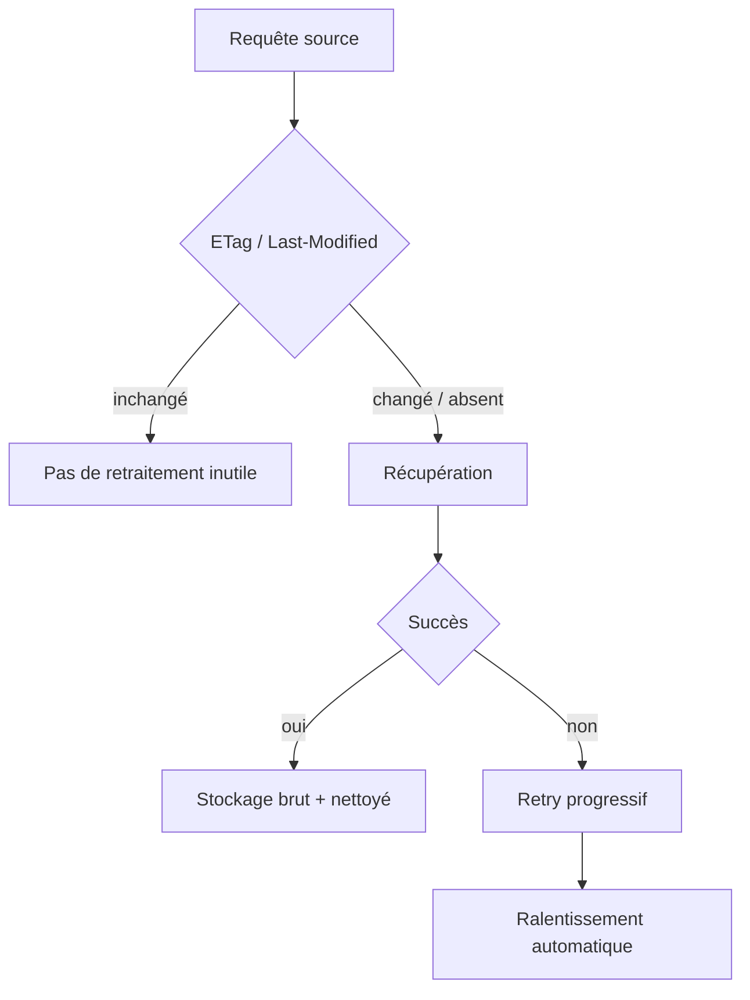

# Sources — Radar IA

Version de référence : **1.0**  
Source officielle : [`handoff.md`](../handoff.md)

Ce document formalise la **doctrine des sources** et les règles de collecte associées.

Documents liés : [`ARCHITECTURE.md`](../Architecture/ARCHITECTURE.md), [`CONFIGURATION.md`](../Setup/CONFIGURATION.md), [`SECURITY.md`](SECURITY.md).

---

## Principe

Radar IA ne traite que des sources **fiables et classées**.  
Toutes les sources sont **configurables hors code**.

### Règle absolue

**Aucun réseau social n'est utilisé comme source.**

Cette décision est majeure et gelée. Elle ne doit pas être contournée par configuration ou exception implicite.

---

## Niveaux S à E

| Niveau | Catégorie |
|--------|-----------|
| **S** | Sources officielles |
| **A** | Documentation / Releases |
| **B** | Benchmarks indépendants |
| **C** | Recherche |
| **D** | Open Source |
| **E** | Presse spécialisée |

Ces niveaux structurent la confiance et le traitement éditorial.  
Les critères fins de pondération numérique par niveau restent une réserve d’exploitation (gels 006 / 007) — ne pas inventer de coefficients hors arbitration.

---

## Validation

Règles validées :

- seules des sources classées S–E sont admissibles ;
- les réseaux sociaux sont exclus ;
- la configuration des sources est externe au code.

Les procédures opérationnelles détaillées de validation / revue d'une nouvelle source ne sont pas encore publiées dans le handoff.

---

## Rafraîchissement

Doctrine de collecte associée :

- **collecte incrémentale** ;
- prise en charge de **ETag** et **Last-Modified** ;
- **retry progressif** en cas d'échec ;
- **ralentissement automatique** des sources en erreur.

---

## Déduplication

Le système distingue trois notions :

| Notion | Rôle |
|--------|------|
| **Source** | Origine de l'information |
| **Événement** | Fait ou annonce détecté |
| **Dossier** | Unité métier de suivi |

Les nouvelles informations **enrichissent un dossier existant** si elles apportent une **réelle valeur**.  
Sinon, elles ne doivent pas créer de bruit (doublon inutile).

Les règles de rattachement sont appliquées par le moteur de matching (`@radar-ia/shared`) ; vue d’ensemble : [`ARCHITECTURE.md`](../Architecture/ARCHITECTURE.md).
Les seuils numériques et fenêtres exactes sont des constantes d’implémentation, pas des réglages utilisateur.

---

## Protection SSRF

La collecte intègre une **protection SSRF**.  
Objectif : empêcher que la récupération de sources conduise à des requêtes vers des cibles non autorisées (réseau interne, métadonnées cloud, etc.).

Contrôles livrés (`@radar-ia/collector`) : protocoles HTTP(S) seuls ; refus localhost / IP privées ; résolution DNS puis **connexion pinnée** à l’adresse validée (anti-rebinding DNS — 010.1A) ; revalidation à chaque redirection ; timeouts et plafond de taille de corps.

Voir [`SECURITY.md`](SECURITY.md).

---

## ETag

- Utilisé pour la collecte incrémentale.
- Permet d'éviter le rechargement inutile d'un contenu inchangé lorsque le serveur source le supporte.
- Implémentation (`004.1D`) : `createIncrementalCollector` envoie `If-None-Match` lorsque l’état fournit un `etag` ; la valeur renvoyée par le serveur (y compris ETag faible `W/"..."`) est renvoyée dans `SourceFetchState` — **aucune persistance** à ce stade (état fourni / reçu par l’appelant).

---

## Last-Modified

- Utilisé conjointement (ou alternativement selon le serveur) pour la collecte incrémentale.
- Complète ETag dans la stratégie de rafraîchissement.
- Implémentation (`004.1D`) : envoi de `If-Modified-Since` ; conservation de la chaîne d’en-tête HTTP dans l’état ; réponse `304` → résultat `not-modified` sans parsing du flux.

---

## Stockage

Pour chaque collecte réussie pertinente :

- stockage **brut** ;
- stockage **nettoyé**.

---

## Ce qui n'est pas source

| Type | Statut |
|------|--------|
| Réseaux sociaux | **Jamais** |
| Plateformes hors classification S–E | Non retenues comme sources |
| Idées du Parking (dashboard, API publique, etc.) | Hors doctrine sources |

---

## Configuration

Les sources se configurent **hors code** via un fichier JSON.

| Élément | Valeur |
|---------|--------|
| Exemple versionné | `config/sources.example.json` |
| Fichier local | `config/sources.json` (non versionné) |
| Format racine | `{ "sources": [ ... ] }` |
| Champs | `id`, `name`, `url`, `tier`, `enabled`, `provider` |
| Tiers | `S`, `A`, `B`, `C`, `D`, `E` |
| Providers | `rss`, `atom`, `github_releases` (actifs) ; `html`, `api` (préparés, `enabled=false` obligatoire) |
| API registre | `loadSourceRegistry` / `parseSourceRegistry` / `getEnabledSources` (`@radar-ia/collector`) |
| API collecte | `createIncrementalCollector({ httpClient }).collect(source, state?)` → Provider → `updated` \| `not-modified` |
| API providers | `resolveProvider(type, context)` — RSS / Atom / GitHub Releases / stubs HTML+API |
| API normalisation | `normalizeArticle(source, feed, item)` / `normalizeFeedArticles(source, feed)` → `NormalizedArticle` |
| API persistance articles | `createNormalizedArticleRepository(prisma)` (`@radar-ia/database`, 005.1A) |

### Normalisation des articles (`004.1E`)

Contrat commun indépendant du format d’origine (`NormalizedArticle`) :

- obligatoires : `sourceId`, `sourceTier`, `title`, `url`, `categories`, `feedFormat` ;
- optionnels : `externalId` (guid/id du flux uniquement — jamais l’URL ni un ETag), `publishedAt` / `updatedAt` (ISO 8601 UTC), `author`, `summary`, `content` ;
- URL : absolue HTTP(S), fragment retiré, hostname minuscule, ports par défaut normalisés, query conservée (y compris `utm_*`) ;
- dates invalides omises (jamais inventées) ;
- catégories : trim, déduplication insensible à la casse, ordre de première occurrence ;
- un item invalide est rejeté (`rejected`) sans bloquer le lot ; **aucune** déduplication éditoriale à ce stade.

### Persistance des articles normalisés (`005.1A`)

- modèle PostgreSQL `NormalizedArticle` dans `@radar-ia/database` ;
- identité technique : `sourceId + externalId` si présent, sinon `sourceId + url` (index uniques partiels) ;
- réapparition → mise à jour (pas de doublon) ; même URL / externalId autorisés entre sources distinctes ;
- **pas** de déduplication inter-sources à ce stade du package (module 006) ; la chaîne collecte → normalisation → matching → analyse → publication est orchestrée par `createPipelineOrchestrator` (009.1C).

Règles de validation principales : identifiants slug uniques, URL HTTP(S) absolues sans credentials ni fragment, URL uniques après normalisation, propriétés inconnues refusées.

Voir [`CONFIGURATION.md`](../Setup/CONFIGURATION.md).

---

## Inventaire runtime (2026-08-01 — Correctif 2)

Registre local `config/sources.json` — **25** sources enabled + **1** disabled (`meta-ai-blog`).

Architecture : `Source → Provider → Normalisation → Déduplication → Matching → Analyse → Publication`.

### Audit HTTP (Correctif 2)

| ID | HTTP | Format | Items | Décision |
|----|------|--------|-------|----------|
| `meta-ai-blog` | 404 | — | 0 | **Désactivée** (RSS Meta AI mort ; couverture Llama via `llama-models-releases`) |
| `microsoft-ai-blog` | 410→remplacé | RSS | 10 | URL remplacée par `https://www.microsoft.com/en-us/ai/blog/feed` |
| Autres (24) | 200 | rss/atom | >0 | Conservées |

### Providers

| Provider | Statut | Usage |
|----------|--------|-------|
| `rss` | actif | Blogs / presse |
| `atom` | actif | Cursor blog |
| `github_releases` | actif | Releases Atom GitHub (`…/releases.atom`) |
| `html` | préparé / désactivé | Stub architectural |
| `api` | préparé / désactivé | Stub architectural |

### Ajouts validés (HTTP + corps feed)

| ID | Tier | URL | Justification |
|----|------|-----|---------------|
| `cursor-blog` | S | `https://cursor.com/atom.xml` | Atom officiel blog Cursor |
| `cursor-changelog` | S | `https://cursor.com/changelog/rss.xml` | RSS changelog produit (signal fort versions) |
| `qwen-blog` | S | `https://qwenlm.github.io/blog/index.xml` | Blog officiel Qwen |
| `deepseek-r1-releases` | A | `https://github.com/deepseek-ai/DeepSeek-R1/releases.atom` | Releases Atom officielles DeepSeek |
| `llama-models-releases` | A | `https://github.com/meta-llama/llama-models/releases.atom` | Releases Atom Meta Llama models |
| `ai2-blog` | A | `https://allenai.org/rss.xml` | Blog officiel AI2 / OLMo |

### Refusés / non intégrables dans cette tâche

| Cible | Motif |
|-------|-------|
| Windsurf blog / changelog | Redirection vers Devin ; pas de RSS/Atom officiel compatible |
| xAI / Grok blog | Pas de flux RSS/Atom officiel stable ; `grok-1` releases Atom vide |
| Cohere blog | Endpoint « rss » renvoie HTML |
| Moonshot / Kimi blog | HTML ; Atom `Kimi-K2` sans entrées |
| LM Studio / Open WebUI / SGLang / LiteLLM | Releases Atom disponibles mais reportés (cible 20–30 sources, signal déjà couvert via HF / Ollama / vLLM) |
| Forum Cursor | Bruit communautaire — hors doctrine annonces officielles |
| Meta AI Blog RSS | 404 confirmé (Correctif 2) — désactivé |

### Mode dégradé + importance (rappel)

Avant toute inférence LLM, `evaluateImportance` classe Critical / High / Medium / Low.

Les annonces **Critical** d’éditeurs whitelistés (OpenAI, Anthropic, Google, DeepMind, Meta, Mistral, Cursor, Qwen, DeepSeek, AI2, Ollama, Hugging Face) publient via `deterministic_fallback` **sans attendre Ollama**.

Ce n’est **pas** un miroir RSS.